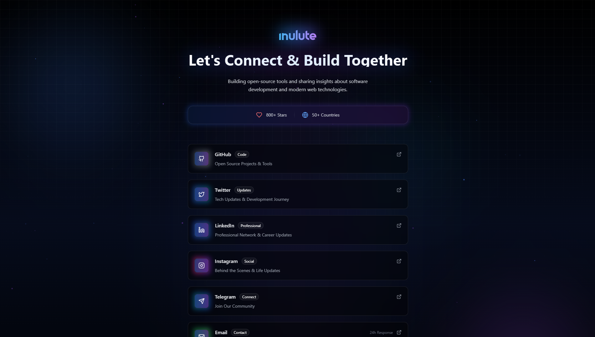

<div align="center">

# Open Linktree

</div>

<div align="center">
  

  <p align="center">
    <strong>A futuristic social links landing page for developers and creators</strong>
  </p>
  
  <p align="center">
    <a href="https://github.com/inulute/socials-page/stargazers">
      
    </a>
    <a href="https://github.com/inulute/socials-page/blob/main/LICENSE">
      
    </a>
  </p>
  
  

<p align="center">
  <a href="https://socials.inulute.com/">
    
  </a>
</p>

</div>

## ✨ Features

- 🎨 **Eye-catching Design** - Captivate visitors with futuristic animations and stunning visuals
- 🧩 **Fully Modular** - Easy configuration through a single config file
- 🚀 **20+ Social Platforms** - Pre-configured with all major social networks and customizable icons
- 📱 **Responsive Layout** - Perfect experience on all devices from mobile to desktop
- ⚡ **Optimized Performance** - Smooth animations and fast loading with optimized code
- 🛡️ **License Protection** - Built-in verification to protect your purchase
- 🌈 **Customizable Themes** - Easily adapt colors and styles to match your brand

## 📦 Installation

Download the package from the [GitHub repository](https://github.com/inulute/open-linktree) or from your purchase email. After downloading, extract the files to your project directory.

## ⚙️ Configuration Guide

The Open Linktree is designed to be fully customizable through a simple configuration file. Here's how to set up your own configuration.

### Creating Your Config File

Create a file named `myConfig.ts` (or `.js` if not using TypeScript) with the following structure:

```typescript

// Profile configuration
export const myProfileConfig: ProfileConfig = {
  logo: "https://your-logo-url.svg",
  title: "Your Name or Brand",
  description: "Your personal tagline or description",
  stats: [
    {
      icon: "Heart",
      value: "1K+ Followers",
      color: "text-red-400"
    },
    {
      icon: "Code",
      value: "10+ Projects",
      color: "text-blue-400"
    }
  ],
  footer: {
    text: "Made with ❤️ by",
    highlight: "Your Name",
    encodedMessage: "YOUR_LICENSE_KEY" // Do not modify this
  }
};

// Social links configuration
export const mySocialsConfig: SocialLinkData[] = [
  {
    name: 'GitHub',
    icon: 'Github',
    href: 'https://github.com/yourusername',
    gradient: 'from-gray-600 to-gray-400',
    description: 'Open Source Projects & Tools',
    tag: 'Code',
    isActive: true // Set to false to hide
  },
  {
    name: 'Twitter',
    icon: 'Twitter',
    href: 'https://twitter.com/yourusername',
    gradient: 'from-blue-600 to-cyan-600',
    description: 'Tech Updates & Development Journey',
    tag: 'Updates',
    isActive: true // Set to false to hide
  },
  // Add more social links as needed...
];

// Optional: Background configuration
export const myBackgroundConfig = {
  particleColors: ["#4D7BF3", "#A84CF3", "#F34C8A"],
  particleCount: 75,
  gridPattern: true,
  orbs: [
    { position: "top-20 left-10", size: "w-96 h-96", color: "bg-blue-500/20", animationDuration: "8s" },
    { position: "bottom-20 right-10", size: "w-96 h-96", color: "bg-purple-500/20", animationDuration: "10s" },
    { position: "top-1/4 right-1/4", size: "w-64 h-64", color: "bg-cyan-500/10", animationDuration: "12s" },
  ],
};

// Optional: UI element configuration
export const myUIConfig = {
  supportButton: {
    icon: "Coffee",
    position: "fixed bottom-8 right-8",
    gradient: "from-blue-600 to-purple-600",
  },
  animations: {
    staggerDelay: 150,
    entranceDelay: 300,
  },
  cardStyles: {
    borderColor: "border-white/10",
    activeBorderColor: "border-white/30",
    backgroundOpacity: "bg-black/40",
    backdropBlur: "backdrop-blur-xl",
  }
};
```

### Customizing Your Profile

The `ProfileConfig` object allows you to customize your personal profile information:

| Property | Type | Description |
|----------|------|-------------|
| `logo` | string | URL to your logo image |
| `title` | string | Main heading displayed at the top |
| `description` | string | Brief description or tagline |
| `stats` | Stat[] | Array of statistics to display (optional) |
| `footer` | FooterData | Footer information and license key |

#### Stats Configuration

Each stat object in the `stats` array can have:

| Property | Type | Description |
|----------|------|-------------|
| `icon` | string | Name of the Lucide icon |
| `value` | string | Text to display |
| `color` | string | Tailwind CSS color class |

### Customizing Social Links

Each social link in the `mySocialsConfig` array can have:

| Property | Type | Description | Required |
|----------|------|-------------|----------|
| `name` | string | Display name of the platform | Yes |
| `icon` | string | Lucide icon name | Yes |
| `href` | string | URL to your profile | Yes |
| `gradient` | string | Tailwind gradient classes for hover effect | Yes |
| `description` | string | Brief description | No |
| `stats` | string | Statistics (e.g., "500+ Followers") | No |
| `tag` | string | Category label | No |
| `isActive` | boolean | Whether to display this link | Yes |

### Available Social Platforms

The component comes pre-configured with these platforms (you can customize any of them):

- GitHub
- Twitter
- LinkedIn
- YouTube
- Instagram
- Telegram
- Discord
- Medium
- Dev to
- Hashnode
- CodePen
- ProductHunt
- Twitch
- Ko-fi
- Patreon
- Email
- Portfolio
- Reddit
- Stack Overflow
- Mastodon
- Website

### Customizing Background Effects

The optional `backgroundConfig` object allows you to customize the visual effects:

| Property | Type | Description |
|----------|------|-------------|
| `particleColors` | string[] | Array of color hex codes for particles |
| `particleCount` | number | Number of particles to display |
| `gridPattern` | boolean | Whether to show the grid pattern |
| `orbs` | Orb[] | Array of glowing orbs in the background |

#### Orb Configuration

Each orb object can have:

| Property | Type | Description |
|----------|------|-------------|
| `position` | string | Tailwind positioning classes |
| `size` | string | Tailwind width and height classes |
| `color` | string | Tailwind background color with opacity |
| `animationDuration` | string | Duration of the pulse animation |

### Customizing UI Elements

The optional `uiConfig` object allows you to customize UI components:

| Property | Type | Description |
|----------|------|-------------|
| `supportButton` | object | Configuration for the support button |
| `animations` | object | Animation timing settings |
| `cardStyles` | object | Styling for social link cards |

## 🎨 Advanced Customization


### Adding Custom Icons

The component uses [Lucide Icons](https://lucide.dev/). You can use any icon from their library by specifying the icon name.

### Customizing Animations

You can adjust animation timing in the `uiConfig.animations` object:

```typescript
animations: {
  staggerDelay: 150, // Delay between each social link appearing
  entranceDelay: 300, // Initial delay before animations start
},
```


## 🛠️ Troubleshooting

### Common Issues

**Icons not displaying correctly:**
- Ensure you're using valid [Lucide icon names](https://lucide.dev/icons/)
- Check that the icon name matches the exact case (e.g., 'Github' not 'GitHub')

**Gradient effects not working:**
- Use valid Tailwind gradient classes (e.g., 'from-blue-600 to-purple-600')
- Ensure you have Tailwind CSS properly installed and configured

**Animations appear choppy:**
- Try reducing the number of particles in the background configuration
- Optimize images and assets to reduce overall page load

## 💖 Support

Loving Open Linktree? Consider supporting our work!

<p align="center">
  <a href="https://support.inulute.com">
    
  </a>
</p>

Your support helps us maintain and improve Open Linktree for everyone.

## 📝 License

This project is licensed under the MIT License - see the [LICENSE](LICENSE) file for details.

## 🤝 Assistance

If you need any assistance with your Open Linktree, please contact us:

- Email: support@inulute.com
- Twitter: [@inulute](https://twitter.com/inulute)
- GitHub: [Create an issue](https://github.com/inulute/socials-page/issues)

---

<p align="center">
  Made with ❤️ by <a href="https://inulute.com">inulute</a>
</p>